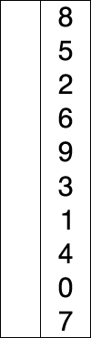

# Métodos de Ordenação: Um comparativo de algoritmos

## Objetivo:
Implementar algoritmos clássicos de ordenação e comparar seus tempos de execução.
O programa gera entradas de tamanho customizável, nas formas aleatória, crescente
e decrescente. Então, lê as entradas armazenando-as em vetores, que serão ordenados,
com seu tempo de execução cronometrado, para estudo posterior.

Autor: Lucas S Portella.

## Definição dos algoritmos de ordenação

### Selection Sort
O _selection sort_ é um dos métodos mais intuitivos de ordenação de arranjos. A ideia geral do algoritmo é de percorrer o vetor da posição inicial até a final, selecionando o menor elemento do arranjo e o colocando em sua posição absoluta. O gif abaixo exemplifica o algoritmo:


Fonte: [Wikipedia](https://upload.wikimedia.org/wikipedia/commons/9/94/Selection-Sort-Animation.gif)

O pseudo-código desse algoritmo pode ser escrito como:

```text
	SELECTION_SORT (VETOR, TAMANHO):
	INICIO
		PARA I DE 0 A TAMANHO - 2:
			MENOR = I
			PARA J DE I A TAMANHO - 1:
				SE (VETOR[J] < VETOR [MENOR]
					MENOR = J

			TROCA(I, MENOR)
	FIM
```
